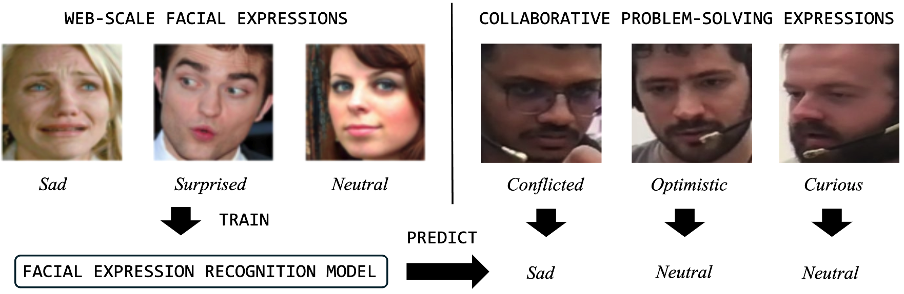

# Evaluating Web-trained Facial Expression Recognition Models in Collaborative Learning




This repository contains the experimental pipeline used in our study evaluating how pretrained facial expression recognition (FER) models behave in collaborative learning settings. The goal of this project is to examine whether common FER outputs—categorical basic emotions and dimensional valence–arousal representations—align with epistemic affective states such as curiosity, confusion, and frustration observed in collaborative problem-solving.

The repository provides tools for dataset preprocessing, running inference using multiple FER models, and performing analyses including cross-taxonomy alignment, dimensional affect structure, and cross-model agreement.

## Overview

Most FER models are trained on large-scale web datasets such as AffectNet. These datasets are annotated using basic emotion categories (e.g., happy, sad, anger) and sometimes dimensional representations (valence and arousal).

However, affective states relevant to collaborative problem-solving are often **epistemic emotions** -- which means they are learning relevant, including:

- Curious
- Confused
- Frustrated
- Optimistic
- Disengaged
- Surprised
- Conflicted

This project evaluates whether pretrained FER models produce meaningful signals for these states when applied to collaborative learning data.

The experimental workflow includes:

1. Extracting and sampling face crops around affect reports
2. Running pretrained FER models
3. Aggregating predictions per affect instance
4. Evaluating alignment between model outputs and epistemic labels
5. Comparing agreement across different FER architectures
6. Comparing behavior on educational data vs AffectNet benchmark data

## Pipeline

### 1. Frame Sampling

For each affect report at time \(t\), we collect all cropped face images within a ±5 second window:

From this pool we randomly sample **K = 10 frames** to represent the instance.

This creates a dataset of labeled face crops used for model inference.


### 2. Model Inference

We evaluate several pretrained FER models.

#### Categorical emotion models

- OpenFace 3.0
- LibreFace
- POSTER++
- DDAMFN
- EmotiEffLib

Each frame produces a categorical emotion prediction.

Instance-level prediction is obtained via:

- **OpenFace 3.0:** mean probability vector
- **Other models:** majority vote across sampled frames

#### Dimensional models

- EmotiEffLib

Instance-level predictions are computed by averaging across frames.

### 3. Evaluation

We perform three main analyses.

#### Cross-taxonomy alignment

Compare predicted basic emotions with epistemic labels using confusion matrices.

Goal: determine whether epistemic states map to consistent emotion predictions.

#### Dimensional affect structure

Visualize valence–arousal outputs:

- scatter plots
- box plots
- clustering behavior

Goal: determine whether epistemic states occupy distinct regions in affect space.

#### Cross-model agreement

Compare predictions between different FER models.

Example:
OpenFace vs LibreFace


Low agreement indicates instability under domain shift.

### 4. AffectNet Control Experiment

To isolate domain shift effects, we run the same models on a subset of AffectNet.

Procedure:

1. Randomly sample N images from AffectNet
2. Run OpenFace and LibreFace
3. Compute cross-model confusion matrix


## Setup

We follow a few steps to setup our codebase for reproducing these experiments.

### Environments

Since we're using different systems with unique package requirements, we've set up multiple virtual environments using conda.

To create and activate a particular conda environment `[environment_name]`, go into `environments/` and run 

```conda env create [environment_name].yml```

```conda activate [environment_name]```

Here are the environments we are currently using:

1) `mist` - for tabular preprocessing, analysis and plotting
2) `openface3` - for running scripts that use OpenFace 3
3) `libreface` - for running scripts that use LibreFace
4) `poster2` - for running scripts that use POSTER++ and DDAMFN (no package conflicts between the two)
5) `hsemotion` - for running scripts that use EmotiEffLib

If you are getting package dependency errors, most likely you are not using the right environment.

### Data
We use two datasets for our experiments: Epistemic Emotions in Collaborative Problem Solving: Weights Task (EECPS-WT) and AffectNet+. EECPS-WT (our contribution) and AffectNet+ are both available to academic researchers only and not for commercial use. 

We will share information about how to access our data to the public after the double-blind review process. Once access is granted, move the dataset directory to the root of the repository and rename it `data`. For AffectNet+, access information is provided here: https://www.mohammadmahoor.com/pages/databases/affectnet/


### Models
We did not use CAGE as we were unable to retrieve the pretrained weights from their github. For the models we have used and reported in the paper, here are the instructions to retrieve the code and weights:

1) OpenFace 3.0 -- inside models/, clone `https://github.com/CMU-MultiComp-Lab/OpenFace-3.0.git`, and follow the instructions to retrieve model weights from their readme. You will also have to clone PyTorch_Retinaface and STAR since they haven't added them as submodules. PyTorch_Retinaface: `https://github.com/biubug6/Pytorch_Retinaface.git`, STAR: `https://github.com/ZhenglinZhou/STAR.git`
2) LibreFace -- inside models/, clone `https://github.com/ihp-lab/LibreFace.git`, that's all. Their pip release takes care of everything else.
3) POSTER++ -- inside models/, clone `https://github.com/Talented-Q/POSTER_V2.git`. Download the checkpoints and put them in their respective locations.
4) DDAMFN - inside models/, clone `https://github.com/SainingZhang/DDAMFN.git`. Checkpoints are available in the git repo.
5) EmotiEffLib - inside models/, clone `https://github.com/sb-ai-lab/EmotiEffLib.git`. Checkpoints are available in the git repo.

### Running

Use the scripts to run specific parts of our experimental pipeline. Some depend on outputs from previous scripts, so best to run them in order. Feel free to adjust the pipeline as you explore the codebase, in many cases the ordering was arbitrary and was based on the timeline of our experimental design decisions.


**To reproduce our experiments, run the scripts in order.**

To modify/extend, consult src/ and write additional scripts to apply your added functionality in src.   


## References
All referenced papers and resources are cited in our paper. We will release a bib file with all references after the double-blind review process.
